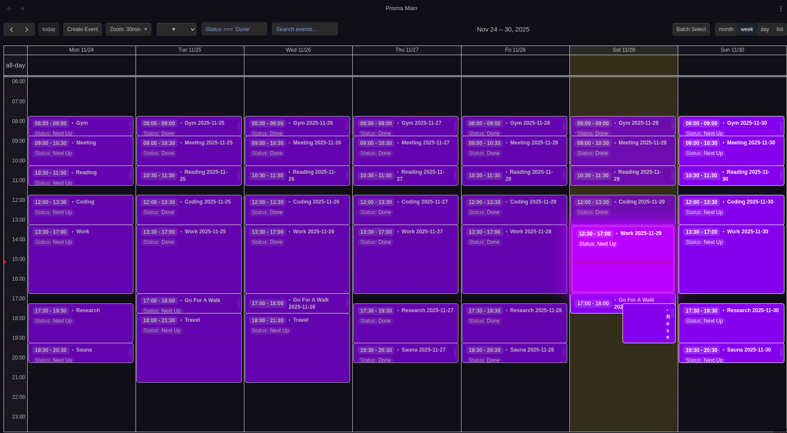
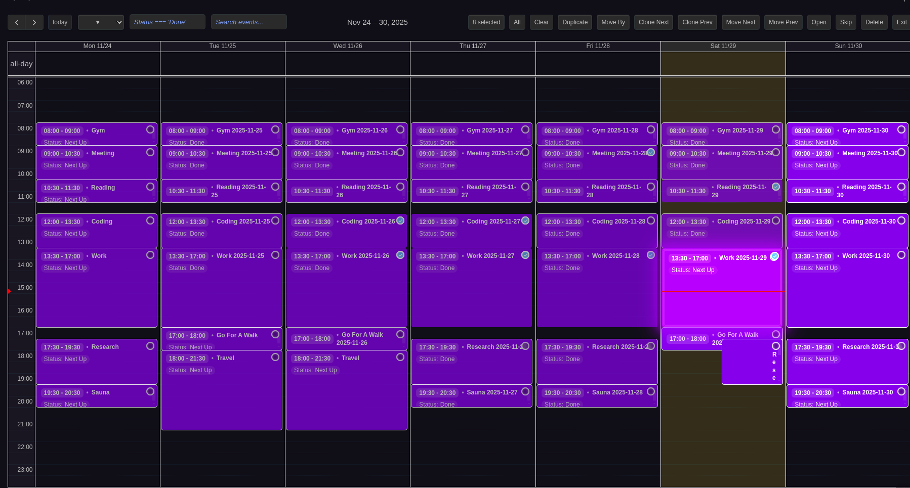
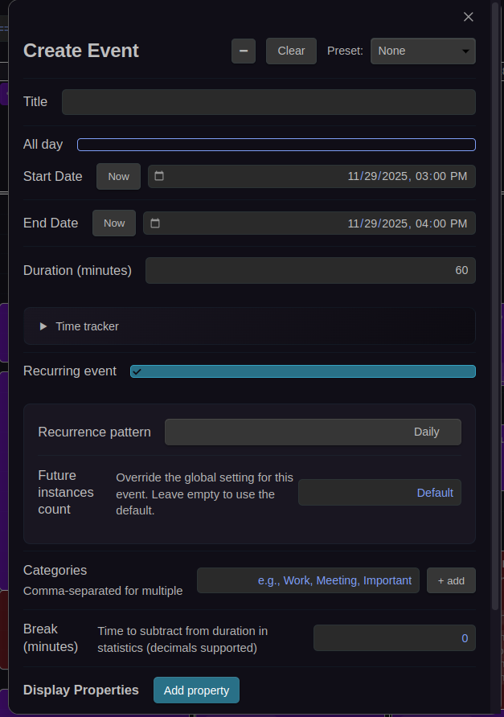
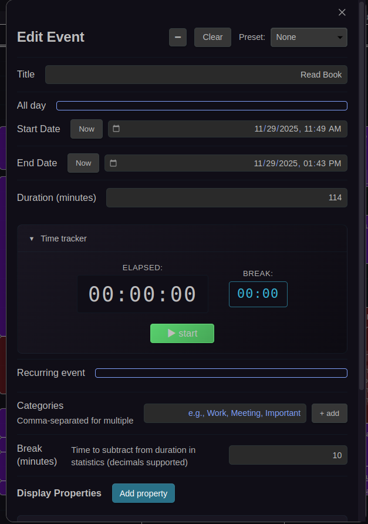
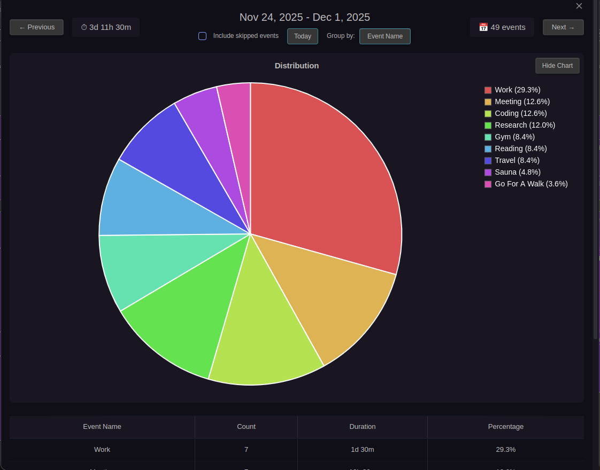
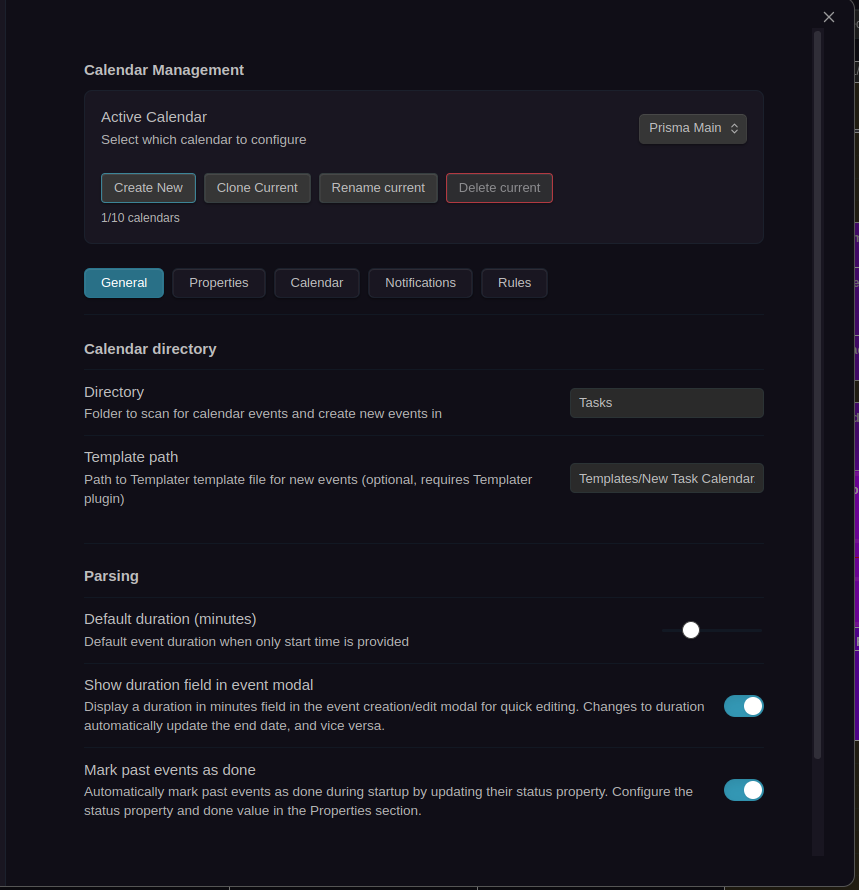

# Prisma Calendar

**The most powerful and flexible calendar plugin for Obsidian — fully configurable, reactive, and built for power users.**

---

## 🎬 Video Tutorials

### Part 1: Feature Showcase — Core Capabilities

**Core Features Walkthrough**: This video covers many of the fundamental features of Prisma Calendar including event creation, editing, batch operations, undo/redo system, recurring events, color rules, and more. A comprehensive introduction to the essential tools that make Prisma Calendar powerful.

### Part 2: Deep Dive — Intelligence & Automation

**Advanced Features Deep Dive**: This Part 2 explores additional features that didn't make it into the first video: intelligent notifications, global event search, navigation tools, statistics and time-tracking insights, and filtering presets. Discover the advanced systems that bring even more power to your workflow.

---

## 📸 Screenshots

### Full Calendar View

*Weekly calendar view with color-coded events, time grid, and powerful toolbar*

### Batch Operations

*Select multiple events for bulk operations like delete, duplicate, move, or skip*

### Event Creation & Editing

*Create and edit events with full frontmatter support, recurring event options, and built-in time tracker*

### Weekly Statistics

*Visual time tracking with pie charts and detailed breakdown tables*

### Settings

*Fully configurable settings for each calendar with tabs for General, Properties, Calendar UI, Notifications, and Rules*

---

## 📚 Documentation

**[View Full Documentation →](https://real1tyy.github.io/Prisma-Calendar/)**

Quick Links:
- [Installation](https://real1tyy.github.io/Prisma-Calendar/installation) • [Quickstart](https://real1tyy.github.io/Prisma-Calendar/quickstart) • [Configuration](https://real1tyy.github.io/Prisma-Calendar/configuration)
- [Features Overview](https://real1tyy.github.io/Prisma-Calendar/features/overview) • [FAQ](https://real1tyy.github.io/Prisma-Calendar/faq) • [Troubleshooting](https://real1tyy.github.io/Prisma-Calendar/troubleshooting)

---

## 📦 Installation

Prisma Calendar is currently **awaiting approval** for the Obsidian Community Plugin store. In the meantime, you can install it using one of these methods:

### 🎯 Recommended: BRAT (Beta Reviewers Auto-update Tool)

The easiest way to install and keep Prisma Calendar up to date:

1. Install the [BRAT plugin](https://github.com/TfTHacker/obsidian42-brat) from Obsidian's Community Plugins
2. Open BRAT settings (Settings → BRAT)
3. Click **Add Beta Plugin**
4. Enter this repository URL: `https://github.com/Real1tyy/Prisma-Calendar`
5. Click **Add Plugin**
6. Enable Prisma Calendar in Settings → Community Plugins

**Benefits**: Automatic updates, smooth experience, one-click installation

### 📥 Manual Installation from GitHub Releases

1. Go to [Releases](https://github.com/Real1tyy/Prisma-Calendar/releases)
2. Download the latest release assets:
   - `main.js`
   - `manifest.json`
   - `styles.css`
3. Create folder: `{VaultFolder}/.obsidian/plugins/prisma-calendar/`
4. Move downloaded files into the folder
5. Reload Obsidian (Ctrl/Cmd + R)
6. Enable Prisma Calendar in Settings → Community Plugins

**Note**: All releases are versioned and tagged for easy reference.

### ✨ Coming Soon

Once approved for the Community Plugin store, you'll be able to install Prisma Calendar directly from Settings → Community Plugins → Browse.

---

## **Top 5 Killer Features**

### **1️⃣ Flexibility — Fully Configurable Everything**
Every aspect of Prisma Calendar is customizable. From frontmatter properties to calendar appearance and behavior, everything adapts to **your** workflow. You define the rules — Prisma Calendar follows.

- **Custom frontmatter mapping** - Use your own property names (`Start`, `Begin`, `Date` — your choice)
- **Dynamic color rules** - JavaScript expressions for intelligent event coloring
- **Filtering system** - Show/hide events based on any frontmatter property
- **View customization** - Adjust time ranges, zoom levels, display density, and visual themes
- **Multiple calendars** - Up to 10 isolated calendars, each with independent settings

### **2️⃣ Reactivity — No Restarts. Ever.**
Change a setting → The calendar **immediately updates**. No more restarting Obsidian. Every parameter, toggle, or setting change is applied live, instantly reflecting in your workspace.

- **Instant feedback** - All settings changes apply in real-time
- **Live recalculation** - Color rules, filters, and views update automatically
- **Zero downtime** - Never interrupt your workflow with restarts

### **3️⃣ History & Memento System — Undo / Redo Like a Pro**
Prisma Calendar keeps a complete memento history of your actions. Every move, edit, or deletion can be undone or redone instantly. Misclicked? Don't worry — we've got you covered.

- **Command pattern architecture** - Every action is undoable
- **Semantic undo** - See exactly what you're undoing ("Undo Create Event", "Undo Batch Delete")
- **Full history** - Undo/redo across all calendar operations
- **Safety net** - Experiment confidently knowing you can always revert

### **4️⃣ Recurring Events — Smart, Linked, Isolated**
Recurring events are built around a **source node** that defines frequency (daily, weekly, bi-weekly, etc.). Each instance is an independent Obsidian note, fully linked to its source — giving you both structure and freedom.

- **Source node architecture** - One configuration file controls the entire series
- **Real note generation** - Physical Obsidian notes, not just calendar entries
- **Complete inheritance** - All frontmatter and content copied to instances
- **Virtual previews** - See far-future instances without cluttering your vault
- **Source navigation** - Jump between instances and their source with one click
- **Calendar creation** - Create recurring events directly from the calendar interface with full frontmatter support

### **5️⃣ Batch Operations — Work Fast, Think Big**
Select multiple events and perform bulk actions: **clone, move, skip, delete, or open them** — all at once. Perfect for power users who value efficiency and speed.

- **Multi-select mode** - Click to select multiple events
- **Bulk operations** - Delete, duplicate, move, or clone selected events
- **Skip functionality** - Mark events as skipped without deletion
- **Batch open** - Open all selected event files in editor tabs
- **Week shifting** - Move or clone entire sets of events forward/backward

---

## ✨ **Additional Powerful Features**

### 📋 **Enhanced Event Interaction**
- **Clickable frontmatter** - All frontmatter properties are interactive and linkable
- **Enlarged previews** - Expanded view showing complete frontmatter and content
- **Quick create button** - Create events instantly from the calendar interface
- **Event skipping** - Skip recurring event instances without breaking the series
- **Hover previews** - See note content without opening files

### 🔗 **Recurring Event Management**
- **Source button** - Navigate to source node from any recurring instance
- **Instance dropdown** - View all physical instances of a recurring series
- **Past filter** - Toggle past event visibility to reduce clutter
- **Virtual event source preview** - Click virtual events to see their source configuration
- **Atomic creation** - Recurring events created via calendar are instantly indexed

### 🗓️ **Multiple Isolated Calendars**
- **Up to 10 separate calendars** with independent configuration
- **Dedicated folders** - Each calendar scans its own directory tree
- **Custom hotkeys** - Instant switching between calendars
- **Clone & duplicate** - Copy calendars with all settings intact

### 📁 **Smart Event Management**
- **Folder-based scanning** - Any note with frontmatter becomes an event
- **Templater integration** - Scaffold consistent event metadata automatically
- **Deep linking** - Click events to open notes, follow wikilinks
- **Batch file operations** - Open multiple event files simultaneously

### 🎨 **Dynamic Visual Customization**
- **JavaScript-powered color rules** - `fm.Priority === 'High' → #ef4444`
- **Property-based filtering** - Show/hide events with complex expressions
- **Frontmatter display** - Show extra frontmatter properties inside event chips
- **Multiple view modes** - Month, week, day, list with customizable time ranges
- **Zoom controls** - CTRL+scroll with configurable zoom levels (1-60 minutes)

### ⚡ **Performance & UX**
- **Debounced scanning** - Efficient file watching and processing
- **Compact/comfortable** display density options
- **Fast indexing** - Optimized for large vaults with many events

## Support & Sponsorship

If you find Prisma Calendar useful and want to support its ongoing development, please consider becoming a sponsor. Your contribution helps ensure continuous maintenance, bug fixes, and the introduction of new features.

-   [Sponsor on GitHub](https://github.com/sponsors/Real1tyy)
-   [Buy Me a Coffee](https://www.buymeacoffee.com/real1ty)

Every contribution, no matter the size, is greatly appreciated!

## Contributing

MIT-licensed. PRs welcome!
