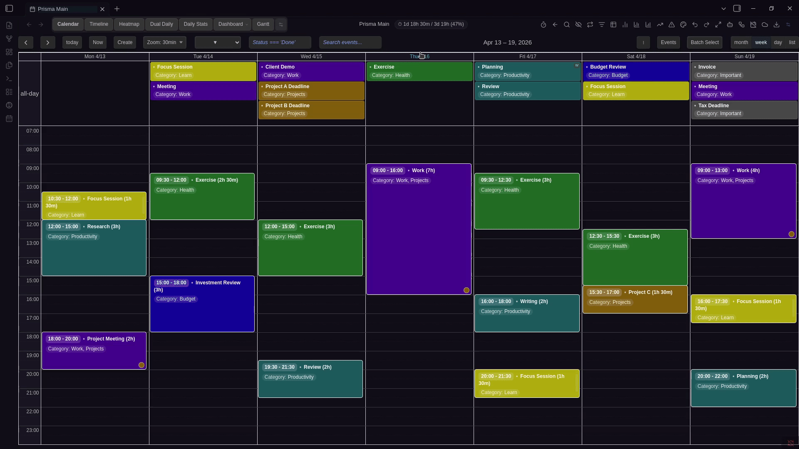
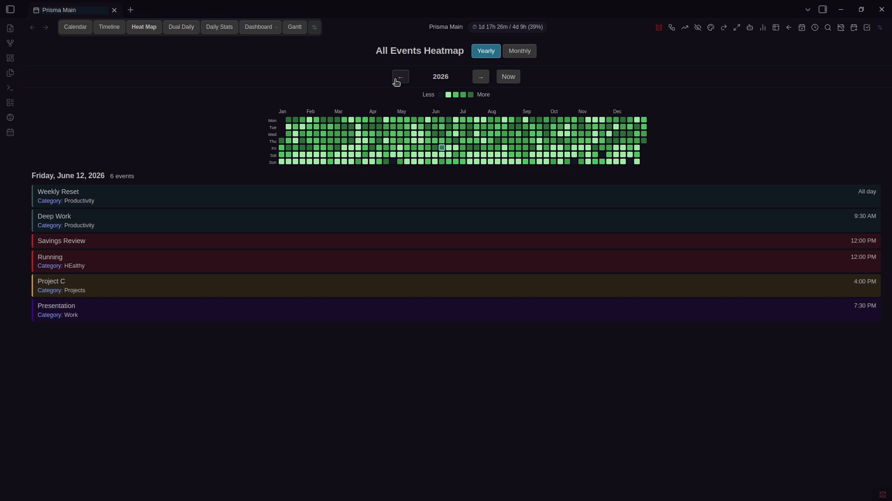
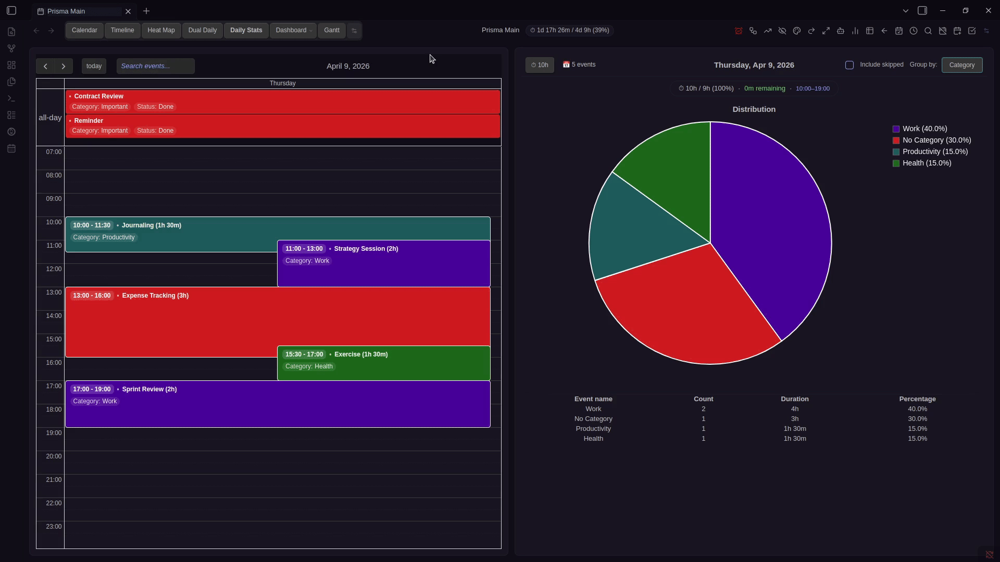

# Prisma Calendar

  

**The Ultimate Flexible Planning System for Obsidian.**

Prisma Calendar is a **schema-agnostic planning system** that turns any Obsidian note with a date into a first-class citizen on your timeline. No rigid schemas, no predefined fields — just your data, your rules, your filters, rendered exactly how you need it.

It's not just a calendar. It's a way to **see your entire vault through time**.

**Every setting is configurable. Every change is reactive. Every action is undoable.**

**Four dedicated views — four ways to understand time.** Calendar for scheduling, Timeline for sequencing, Heatmap for patterns, and Gantt for dependencies. Each reveals a different perspective, and together they turn Prisma into a complete planning system.

A full scripting API. External integrations sync. Recurring events that generate real notes. Batch operations, undo/redo history, and time-based analytics across multiple series.

**[View Full Product Page →](https://matejvavroproductivity.com/tools/prisma-calendar/?utm_campaign=prisma_calendar&utm_source=github&utm_medium=repo&utm_content=readme_product_page)**

### The Missing Piece for Your Obsidian Workflow

Other Obsidian calendar plugins give you a basic view. Prisma Calendar gives you **a complete planning system** — with the depth of a standalone app and the seamless integration only a native plugin can offer.

The core challenge for power users is simple: how do you visualize entirely disparate records — sharing only a timestamp — in a single, cohesive view? Prisma solves this by stepping beyond the definition of a "calendar." It is a planning system that takes any data with a time parameter and renders it using your custom rules, properties, and filters. Projects, habits, meetings, tasks, people — if it has a date, Prisma displays it.

Prisma is fundamentally different from any conventional calendar. Tools like Google Calendar lock you into predefined fields that rarely fit complex needs. Platforms like Notion lack the seamless database visualization required for advanced workflows. Prisma breaks free from both.

It takes any data with a time parameter and projects it onto a unified, fully customizable timeline. For Obsidian users managing thousands of heavily customized markdown files, Prisma flawlessly renders those individual properties onto a single cohesive view — turning your vault into a full **enterprise resource planning** system. Plan projects, track habits, manage people, schedule tasks — all powered by the frontmatter you already write.

Prisma is production-ready, fully featured, and built for users who demand absolute freedom over how their information is visualized.

---

## 🎬 The Complete Encyclopedia

**Every feature systematically broken down from A to Z**: views, event management, recurring events, time tracking, categories, color rules, batch operations, filtering, integrations, AI, the programmatic API, and every setting explained. This is both a full walkthrough and a long-term reference — the definitive video for Prisma Calendar.

**[YouTube Playlist →](https://www.youtube.com/playlist?list=PLMVJknbUasLCULubO4MdCDvg9MyXu3kG4&utm_campaign=prisma_calendar&utm_source=github&utm_medium=repo&utm_content=readme_playlist)** — All Prisma Calendar videos.

---

## 📸 Gallery

Check out the [full gallery](https://real1tyy.github.io/Prisma-Calendar/gallery?utm_campaign=prisma_calendar&utm_source=github&utm_medium=repo&utm_content=readme_gallery) in the documentation for more visuals.

---

## 📚 Documentation

**[View Full Documentation →](https://real1tyy.github.io/Prisma-Calendar/?utm_campaign=prisma_calendar&utm_source=github&utm_medium=repo&utm_content=readme_documentation)**

Quick Links:

- [Installation](https://real1tyy.github.io/Prisma-Calendar/installation?utm_campaign=prisma_calendar&utm_source=github&utm_medium=repo&utm_content=readme_installation) • [Quickstart](https://real1tyy.github.io/Prisma-Calendar/quickstart?utm_campaign=prisma_calendar&utm_source=github&utm_medium=repo&utm_content=readme_quickstart) • [Configuration](https://real1tyy.github.io/Prisma-Calendar/configuration?utm_campaign=prisma_calendar&utm_source=github&utm_medium=repo&utm_content=readme_configuration)
- [Features Overview](https://real1tyy.github.io/Prisma-Calendar/features/overview?utm_campaign=prisma_calendar&utm_source=github&utm_medium=repo&utm_content=readme_features_overview) • [FAQ](https://real1tyy.github.io/Prisma-Calendar/faq?utm_campaign=prisma_calendar&utm_source=github&utm_medium=repo&utm_content=readme_faq) • [Troubleshooting](https://real1tyy.github.io/Prisma-Calendar/troubleshooting?utm_campaign=prisma_calendar&utm_source=github&utm_medium=repo&utm_content=readme_troubleshooting)

---

## Why Prisma Calendar?

### **Configure Literally Everything**

Prisma Calendar adapts to you, not the other way around. Map your own frontmatter properties, define JavaScript-powered color rules, set up advanced filters, customize the appearance down to event text, icons, and density — and manage **multiple independent planning systems**, each with their own settings and folder scope.

### **Fully Reactive — Changes Propagate Instantly**

There's no "restart Obsidian to apply changes" here. Every setting change, every color rule tweak, every filter adjustment takes effect **immediately**. Edit a note's frontmatter and watch the planning system update in real time. This isn't a static display — it's a live, reactive system.

### **Undo and Redo Everything**

Every action you take — creating, editing, moving, deleting, batch operations — is tracked in a full memento history. Made a mistake? Hit undo. Changed your mind? Redo. You'll see exactly what's being reversed ("Undo Batch Delete", "Undo Move Event") so you're always in control.

### **Recurring Events That Actually Work**

Define a source node with a frequency (daily, weekly, bi-weekly, monthly, ...), and Prisma generates **real Obsidian notes** for each instance — fully linked back to the source. Virtual previews let you see future instances without cluttering your vault. Navigate between instances with one click, and view statistics about your recurring series at a glance.

### **Batch Operations at Scale**

Select multiple events and delete, duplicate, move, clone, skip, or open them — all at once. Shift entire weeks of events forward or backward. When you're managing a busy schedule, this isn't a nice-to-have — it's essential.

### **Smart Categories with Title Autocomplete**

Define categories with color coding, then let Prisma **auto-assign them** based on event names. Title autocomplete suggests matching names as you type, keeping naming consistent and preventing typos. Categories also power event group aggregation, giving you a bird's-eye view of related events across your planning system.

### **Statistics and Time Insights**

Track how you spend your time with visual statistics — pie charts, breakdowns by category, and detailed tables — all filterable by time horizon. See where your hours go across days, weeks, or months. Recurring event series get their own statistics too, so you can track consistency and trends.

### **Built-in Notifications**

Set up reminders for your events and get notified directly inside Obsidian. Never miss an important event without needing an external tool.

### **Time Tracker**

Start and stop a timer directly from any event modal. Track actual time spent on tasks, compare it against planned durations, and build a real picture of how your time is used.

### **Event Presets and Templates**

Create reusable event presets so you can spin up new events with pre-filled frontmatter in seconds. Pair with Templater integration for even more powerful template-driven workflows.

### **Scriptable via Programmatic API**

Prisma Calendar exposes a programmatic API, so you can create, modify, and query events from scripts, Templater templates, or other plugins. Automate event creation, build custom workflows, and integrate your planning system into your broader Obsidian setup.

### **CalDAV and ICS Integration**

Sync events from external CalDAV servers (Fastmail, Nextcloud, iCloud, and more) or import/export `.ics` files — compatible with Google Calendar, Microsoft Outlook, and any service that supports the ICS standard. Synced events become real Obsidian notes with full frontmatter. Connect multiple sources to different calendars with configurable auto-sync intervals.

### **Tabbed Views**

Switch between Calendar (month/week/day/list), Timeline, Daily+Stats, and Dual Daily views — all in a persistent tabbed container. Tabs can be reordered, renamed, and hidden. Pro adds Heatmap (GitHub-style contribution view), Gantt (dependency-aware timeline), and Dashboard (pie charts, stat cards, sortable tables). Zoom into time slots from 1 to 60 minutes. Display frontmatter properties inside event chips. Filter with complex expressions.

### **55+ Header Actions**

One-click shortcut buttons for event creation, search, statistics, category highlighting, undo/redo, AI chat, and more — all customizable. Reorder, rename, change icons and colors, or hide actions via the gear button.

### **Capacity Tracking**

See at a glance how full your schedule is. A compact indicator shows today's used vs total hours (e.g., "7h 30m / 11h (68%)") with remaining time and inferred boundaries. No configuration needed — boundaries are detected automatically from your earliest and latest events.

### **Global Event Management**

Browse, search, and manage all events across all your planning systems from a single unified interface. Auto-group events by recurring rule, category, or name with the Event Series Modal. View series statistics, timelines, and heatmaps from one place.

---

## 📱 **Mobile Support**

Core features work on mobile without any problems. The design is responsive, and I'm continuously tightening up the mobile experience based on feedback to make it rock solid. If you run into anything, please open a [GitHub issue](https://github.com/Real1tyy/Prisma-Calendar/issues?utm_campaign=prisma_calendar&utm_source=github&utm_medium=repo&utm_content=readme_issues).

---

## 📦 Installation

Install via **BRAT**, the **Obsidian Community Plugin store**, or manually from [GitHub Releases](https://github.com/Real1tyy/Prisma-Calendar/releases?utm_campaign=prisma_calendar&utm_source=github&utm_medium=repo&utm_content=readme_releases).

**[Full installation guide →](https://real1tyy.github.io/Prisma-Calendar/installation?utm_campaign=prisma_calendar&utm_source=github&utm_medium=repo&utm_content=readme_installation_guide)**

## Free vs Pro

Prisma Calendar is free and fully-featured out of the box. No account, no trial — just install and go.

[Learn more about Free vs Pro →](https://real1tyy.github.io/Prisma-Calendar/features/free-vs-pro?utm_campaign=prisma_calendar&utm_source=github&utm_medium=repo&utm_content=readme_free_vs_pro)

### What you get for free

Tabbed view navigation (Calendar, Timeline, Daily+Stats, Dual Daily), 55+ customizable header actions, up to 3 independent planning systems, up to 2 event presets, recurring events (9 types + custom intervals with real note generation), 50-action undo/redo, 10+ batch operations, built-in time tracker, capacity tracking, statistics dashboard, event groups, JavaScript color rules, advanced filtering with saved presets, desktop notifications, holidays (50+ countries), title autocomplete, auto-assign categories, untracked events inbox, ICS import/export, and 60+ hotkeys.

### What Pro adds

AI Chat (Claude & GPT), Heatmap View, Dashboard, Gantt View, Bases Calendar View, Prerequisite Connections, CalDAV & ICS URL Sync, Programmatic API, Custom Category Presets, Unlimited Planning Systems, Unlimited Event Presets, and Priority Support.

---

## Support & Sponsorship

The best way to support Prisma Calendar is by purchasing the **[Advanced Features](https://real1tyy.github.io/Prisma-Calendar/features/free-vs-pro?utm_campaign=prisma_calendar&utm_source=github&utm_medium=repo&utm_content=readme_advanced_features)** license. You get powerful pro capabilities, priority support, and you directly fund the continued development of the plugin — allowing me to dedicate my time to maintaining and improving it.

You can also support the project through a donation:

- [View all donation options](https://matejvavroproductivity.com/support/?utm_campaign=prisma_calendar&utm_source=github&utm_medium=repo&utm_content=readme_donation)

Every contribution, no matter the size, is greatly appreciated!

## Third-Party Independence

Prisma Calendar is developed by [Matej Vavro](https://matejvavroproductivity.com/?utm_campaign=prisma_calendar&utm_source=github&utm_medium=repo&utm_content=readme_author) and is an independent, third-party product. **We are not affiliated with, endorsed by, or sponsored by Obsidian (Dynalist Inc.).** Prisma Calendar is a third-party community plugin. All references to "Obsidian" are for descriptive and compatibility purposes only.

## Privacy & Telemetry

Prisma Calendar **does not include any client-side telemetry or analytics** — no vault content, file names, or personal data is ever transmitted. The only server communication happens during Pro license verification, which sends basic device and version info for activation seat management. **If you only use the free features, no data is collected at all.**

[Privacy Policy](https://matejvavroproductivity.com/privacy/?utm_campaign=prisma_calendar&utm_source=github&utm_medium=repo&utm_content=readme_privacy) · [Terms of Service](https://matejvavroproductivity.com/terms/?utm_campaign=prisma_calendar&utm_source=github&utm_medium=repo&utm_content=readme_terms) · [Legal Notice](https://matejvavroproductivity.com/legal/?utm_campaign=prisma_calendar&utm_source=github&utm_medium=repo&utm_content=readme_legal)

## License

[AGPL-3.0](./LICENSE).

---

## Credits & Acknowledgments

Prisma Calendar is built using [FullCalendar](https://fullcalendar.io/), a powerful and flexible JavaScript calendar library. FullCalendar provides the robust calendar rendering engine that powers Prisma Calendar's views and interactions. We're grateful to the FullCalendar team for creating such an excellent foundation.

---

> **This repository is a public, read-only mirror.** Development happens in a private monorepo — this mirror exists for transparency and to follow the Obsidian convention of one repo per plugin. The code is licensed AGPL-3.0.
