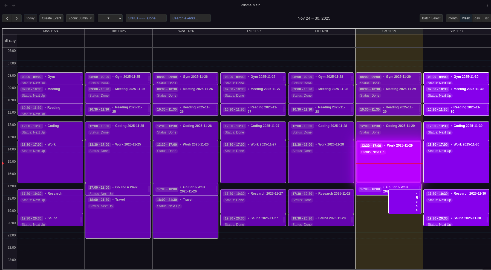
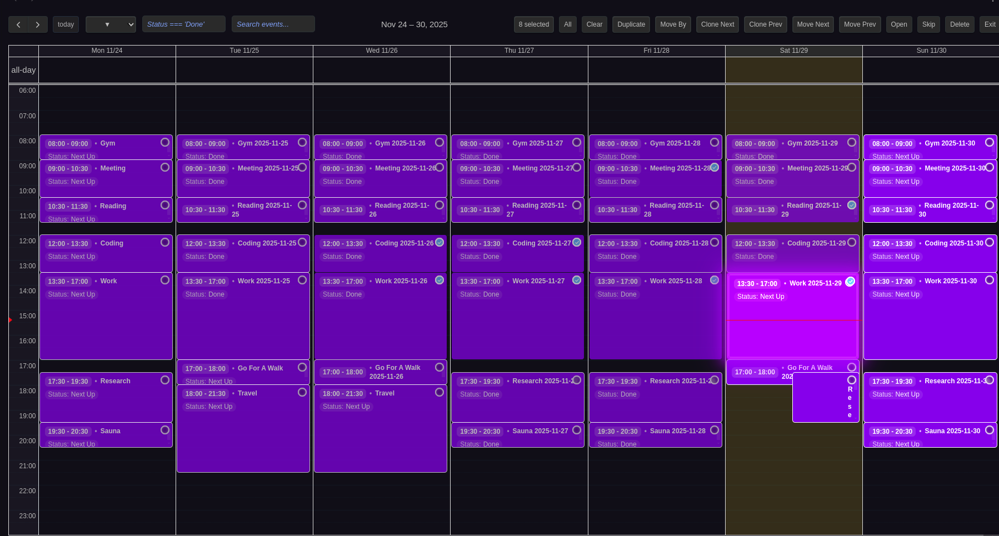
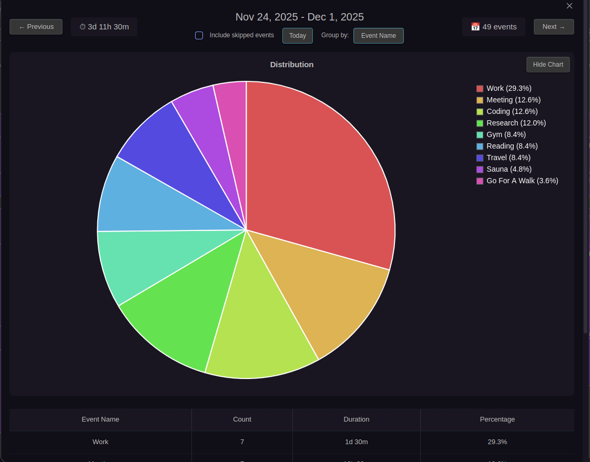

# Prisma Calendar

**The Ultimate Temporal Visualization Engine for Obsidian.**

Prisma Calendar is a **schema-agnostic visualization layer** that turns any Obsidian note with a date into a first-class citizen on your timeline. No rigid schemas, no predefined fields — just your data, your rules, your filters, rendered exactly how you need it.

It's not just a calendar. It's a way to **see your entire vault through time**.

**Every setting is configurable. Every change is reactive. Every action is undoable.**

Whether you need recurring events that generate real notes, batch operations across dozens of events, intelligent category auto-assignment with fuzzy matching, time-based statistics, CalDAV sync, scriptable event creation via API, or just a clean timeline that works exactly how you want — Prisma does it all.

### The Missing Piece for Your Obsidian Workflow

Prisma is fundamentally different from any conventional calendar. Tools like Google Calendar lock you into predefined fields that rarely fit complex needs. Platforms like Notion lack the seamless database visualization required for advanced workflows. Prisma breaks free from both.

It takes any data with a time parameter and projects it onto a unified, fully customizable timeline. For Obsidian users managing thousands of heavily customized markdown files, Prisma flawlessly renders those individual properties onto a single cohesive view — turning your vault into a full **enterprise resource planning** system. Plan projects, track habits, manage people, schedule tasks — all powered by the frontmatter you already write.

Prisma is production-ready, fully featured, and built for users who demand absolute freedom over how their information is visualized.

---

## 🎬 Video Tutorials

**[View All Video Tutorials →](https://real1tyy.github.io/Prisma-Calendar/videos)**

### Part 1: Feature Showcase — Core Capabilities

**Core Features Walkthrough**: This video covers many of the fundamental features of Prisma Calendar including event creation, editing, batch operations, undo/redo system, recurring events, color rules, and more.

For the **Full Tutorial** (Zero to Mastery), **Part 2** (Intelligence & Automation), and **Part 3** (Advanced Workflow Tools), visit the [complete video tutorial collection](https://real1tyy.github.io/Prisma-Calendar/videos).

---

## 📸 Screenshots

### Full Calendar View

_Weekly calendar view with color-coded events, time grid, and powerful toolbar_

### Batch Operations

_Select multiple events for bulk operations like delete, duplicate, move, or skip_

### Event Creation & Editing

_Create and edit events with full frontmatter support, recurring event options, and built-in time tracker_

### Weekly Statistics

_Visual time tracking with pie charts and detailed breakdown tables_

Check out the [complete screenshots gallery](https://real1tyy.github.io/Prisma-Calendar/screenshots) in the documentation to see all the plugin's visuals, including calendar views, event modals, batch operations, statistics, settings, and more.

---

## 📚 Documentation

**[View Full Documentation →](https://real1tyy.github.io/Prisma-Calendar/)**

Quick Links:

- [Installation](https://real1tyy.github.io/Prisma-Calendar/installation) • [Quickstart](https://real1tyy.github.io/Prisma-Calendar/quickstart) • [Configuration](https://real1tyy.github.io/Prisma-Calendar/configuration)
- [Features Overview](https://real1tyy.github.io/Prisma-Calendar/features/overview) • [FAQ](https://real1tyy.github.io/Prisma-Calendar/faq) • [Troubleshooting](https://real1tyy.github.io/Prisma-Calendar/troubleshooting)

---

## 📦 Installation

Prisma Calendar is currently **awaiting approval** for the Obsidian Community Plugin store. In the meantime, you can install it using one of these methods:

### 🎯 Recommended: BRAT (Beta Reviewers Auto-update Tool)

The easiest way to install and keep Prisma Calendar up to date:

1. Install the [BRAT plugin](https://github.com/TfTHacker/obsidian42-brat) from Obsidian's Community Plugins
2. Open BRAT settings (Settings → BRAT)
3. Click **Add Beta Plugin**
4. Enter this repository URL: `https://github.com/Real1tyy/Prisma-Calendar`
5. Click **Add Plugin**
6. Enable Prisma Calendar in Settings → Community Plugins

**Benefits**: Automatic updates, smooth experience, one-click installation

### 📥 Manual Installation from GitHub Releases

1. Go to [Releases](https://github.com/Real1tyy/Prisma-Calendar/releases)
2. Download the latest release assets:
   - `main.js`
   - `manifest.json`
   - `styles.css`
3. Create folder: `{VaultFolder}/.obsidian/plugins/prisma-calendar/`
4. Move downloaded files into the folder
5. Reload Obsidian (Ctrl/Cmd + R)
6. Enable Prisma Calendar in Settings → Community Plugins

**Note**: All releases are versioned and tagged for easy reference.

### ✨ Coming Soon

Once approved for the Community Plugin store, you'll be able to install Prisma Calendar directly from Settings → Community Plugins → Browse.

---

## 📱 **Mobile Support**

**Core features work on mobile without any problems**. We have users who rely on mobile, and thanks to their feedback, we continually improve and tighten up the mobile experience to make it rock solid. Our design is responsive, so most things work, and we're committed to making it even better over time. If you encounter any problems or have suggestions for improvement, please create a [GitHub issue](https://github.com/Real1tyy/Prisma-Calendar/issues) and we'll address it.

---

## Why Prisma Calendar?

Other Obsidian calendar plugins give you a basic view. Prisma Calendar gives you **a complete event management platform** — with the depth of a standalone app and the seamless integration only a native plugin can offer.

The core challenge for power users is simple: how do you visualize entirely disparate records — sharing only a timestamp — in a single, cohesive view? Prisma solves this by stepping beyond the definition of a "calendar." It is a visualization layer that takes any data with a time parameter and renders it using your custom rules, properties, and filters. Projects, habits, meetings, tasks, people — if it has a date, Prisma displays it.

Here's what sets it apart:

### **Configure Literally Everything**

Prisma Calendar adapts to you, not the other way around. Map your own frontmatter properties, define JavaScript-powered color rules, set up advanced filters, customize the calendar appearance down to event text, icons, and density — and manage up to **10 independent calendars**, each with their own settings and folder scope.

### **Fully Reactive — Changes Propagate Instantly**

There's no "restart Obsidian to apply changes" here. Every setting change, every color rule tweak, every filter adjustment takes effect **immediately**. Edit a note's frontmatter and watch the calendar update in real time. This isn't a static display — it's a live, reactive system.

### **Undo and Redo Everything**

Every action you take — creating, editing, moving, deleting, batch operations — is tracked in a full memento history. Made a mistake? Hit undo. Changed your mind? Redo. You'll see exactly what's being reversed ("Undo Batch Delete", "Undo Move Event") so you're always in control.

### **Recurring Events That Actually Work**

Define a source node with a frequency (daily, weekly, bi-weekly, monthly, ...), and Prisma generates **real Obsidian notes** for each instance — fully linked back to the source. Virtual previews let you see future instances without cluttering your vault. Navigate between instances with one click, and view statistics about your recurring series at a glance.

### **Batch Operations at Scale**

Select multiple events and delete, duplicate, move, clone, skip, or open them — all at once. Shift entire weeks of events forward or backward. When you're managing a busy schedule, this isn't a nice-to-have — it's essential.

### **Smart Categories with Fuzzy Matching**

Define categories with color coding, then let Prisma **auto-assign them** based on event names. The built-in fuzzy matching catches typos and close matches, so your events get categorized correctly even when you're typing fast. Categories also power event group aggregation, giving you a bird's-eye view of related events across your calendar.

### **Statistics and Time Insights**

Track how you spend your time with visual statistics — pie charts, breakdowns by category, and detailed tables — all filterable by time horizon. See where your hours go across days, weeks, or months. Recurring event series get their own statistics too, so you can track consistency and trends.

### **Built-in Notifications**

Set up reminders for your events and get notified directly inside Obsidian. Never miss an important event without needing an external tool.

### **Time Tracker**

Start and stop a timer directly from any event modal. Track actual time spent on tasks, compare it against planned durations, and build a real picture of how your time is used.

### **Event Presets and Templates**

Create reusable event presets so you can spin up new events with pre-filled frontmatter in seconds. Pair with Templater integration for even more powerful template-driven workflows.

### **Scriptable via Programmatic API**

Prisma Calendar exposes a programmatic API, so you can create, modify, and query events from scripts, Templater templates, or other plugins. Automate event creation, build custom workflows, and integrate your calendar into your broader Obsidian setup.

### **CalDAV and ICS Integration**

Sync events from external CalDAV servers (Fastmail, Nextcloud, iCloud, and more) or import/export `.ics` files — compatible with Google Calendar, Microsoft Outlook, and any service that supports the ICS standard. Synced events become real Obsidian notes with full frontmatter. Connect multiple sources to different calendars with configurable auto-sync intervals.

### **Multiple Views, Full Control**

Switch between month, week, day, and list views. Zoom into time slots from 1 to 60 minutes. Display extra frontmatter properties inside event chips. Filter events with complex expressions. Toggle holidays on or off. The calendar looks and works exactly how you want it to.

### **Global Event Management**

Browse, search, and manage all events across all your calendars from a single unified interface. No more hunting through folders — everything is accessible from one place.

## Support & Sponsorship

If you find Prisma Calendar useful and want to support its ongoing development, please consider becoming a sponsor. Your contribution helps ensure continuous maintenance, bug fixes, and the introduction of new features.

- [Support My Work](https://matejvavroproductivity.com/support/)

Every contribution, no matter the size, is greatly appreciated!

## License

[AGPL-3.0](./LICENSE). Versions before v2.0.0 were MIT.

## Contributing

PRs welcome! Contributions are licensed under AGPL-3.0.

---

## Credits & Acknowledgments

Prisma Calendar is built using [FullCalendar](https://fullcalendar.io/), a powerful and flexible JavaScript calendar library. FullCalendar provides the robust calendar rendering engine that powers Prisma Calendar's views and interactions. We're grateful to the FullCalendar team for creating such an excellent foundation.
