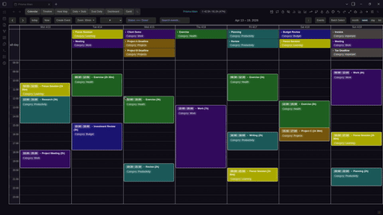
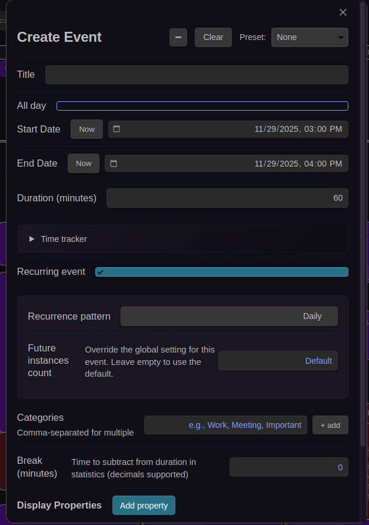
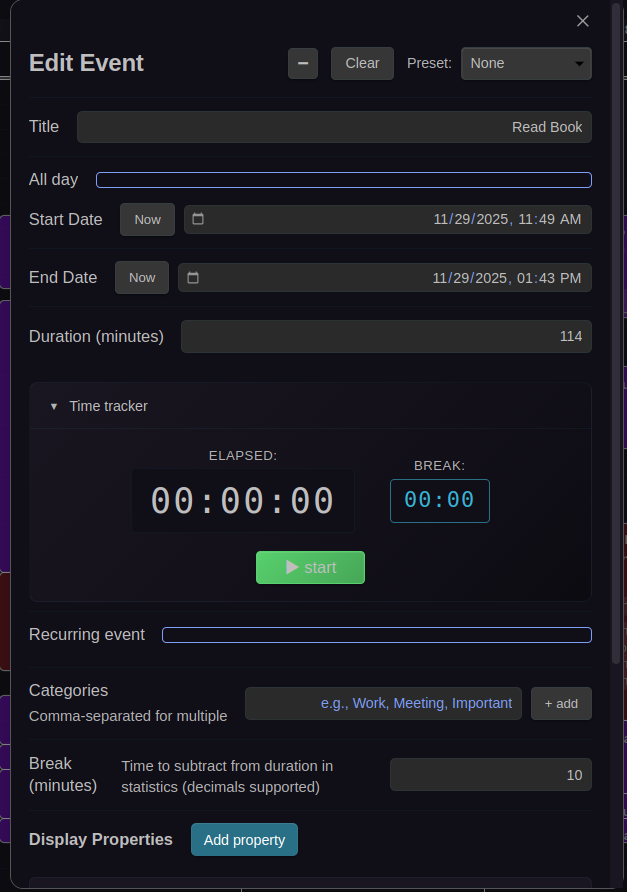
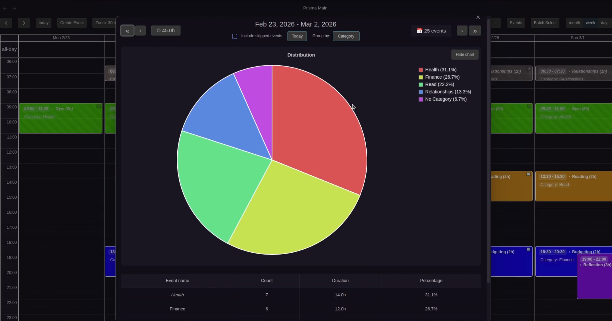
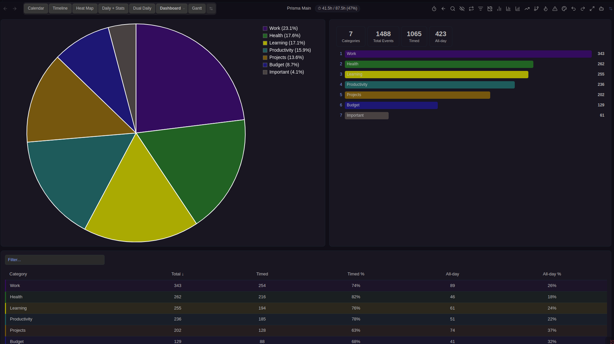
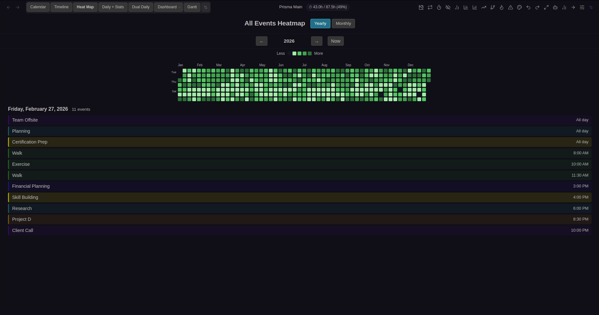
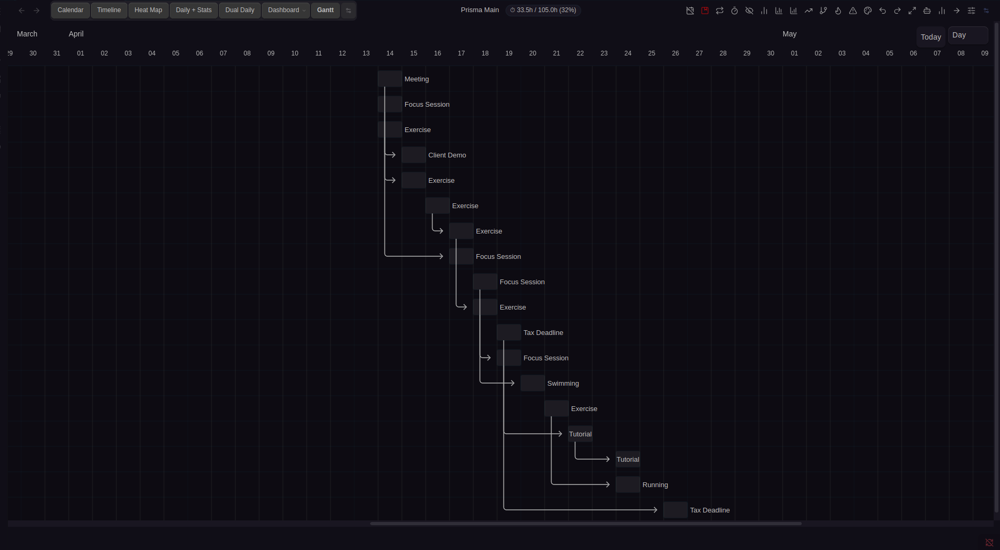
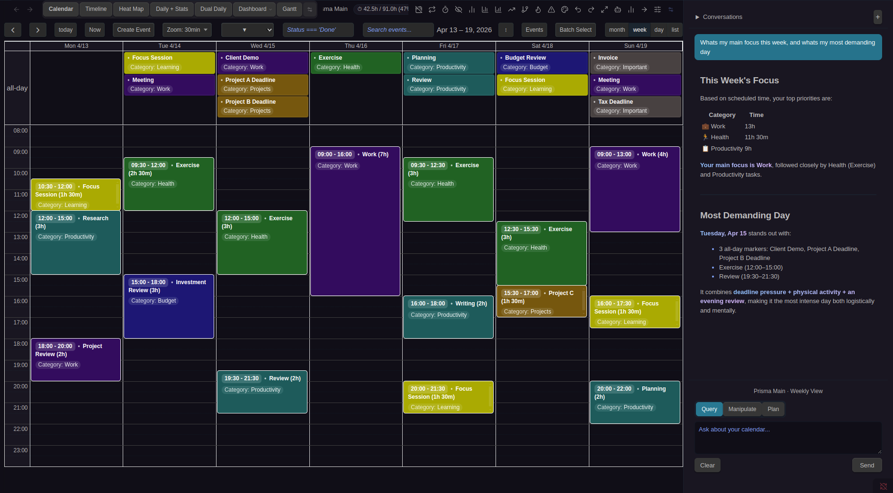

# Prisma Calendar

  

**The Ultimate Temporal Visualization Engine for Obsidian.**

Prisma Calendar is a **schema-agnostic visualization layer** that turns any Obsidian note with a date into a first-class citizen on your timeline. No rigid schemas, no predefined fields — just your data, your rules, your filters, rendered exactly how you need it.

It's not just a calendar. It's a way to **see your entire vault through time**.

**Every setting is configurable. Every change is reactive. Every action is undoable.**

Recurring events that generate real notes. Batch operations across dozens of events. Time-based statistics. CalDAV sync. A scriptable API. Prisma Calendar handles the workflows other calendars can't.

**[View Full Product Page →](https://matejvavroproductivity.com/tools/prisma-calendar/?utm_source=prisma-calendar&utm_medium=readme&utm_content=product-page)**

### The Missing Piece for Your Obsidian Workflow

Other Obsidian calendar plugins give you a basic view. Prisma Calendar gives you **a complete event management platform** — with the depth of a standalone app and the seamless integration only a native plugin can offer.

The core challenge for power users is simple: how do you visualize entirely disparate records — sharing only a timestamp — in a single, cohesive view? Prisma solves this by stepping beyond the definition of a "calendar." It is a visualization layer that takes any data with a time parameter and renders it using your custom rules, properties, and filters. Projects, habits, meetings, tasks, people — if it has a date, Prisma displays it.

Prisma is fundamentally different from any conventional calendar. Tools like Google Calendar lock you into predefined fields that rarely fit complex needs. Platforms like Notion lack the seamless database visualization required for advanced workflows. Prisma breaks free from both.

It takes any data with a time parameter and projects it onto a unified, fully customizable timeline. For Obsidian users managing thousands of heavily customized markdown files, Prisma flawlessly renders those individual properties onto a single cohesive view — turning your vault into a full **enterprise resource planning** system. Plan projects, track habits, manage people, schedule tasks — all powered by the frontmatter you already write.

Prisma is production-ready, fully featured, and built for users who demand absolute freedom over how their information is visualized.

---

## 🎬 Video Tutorials

**[View All Video Tutorials →](https://real1tyy.github.io/Prisma-Calendar/videos?utm_source=prisma-calendar&utm_medium=readme&utm_content=video-tutorials)**

### Part 1: Feature Showcase — Core Capabilities

**Core Features Walkthrough**: This video covers many of the fundamental features of Prisma Calendar including event creation, editing, batch operations, undo/redo system, recurring events, color rules, and more.

For the **Full Tutorial** (Zero to Mastery), **Part 2** (Intelligence & Automation), and **Part 3** (Advanced Workflow Tools), visit the [complete video tutorial collection](https://real1tyy.github.io/Prisma-Calendar/videos?utm_source=prisma-calendar&utm_medium=readme&utm_content=video-collection).

---

## 📸 Screenshots

### Event Creation & Editing

_Create and edit events with full frontmatter support, recurring event options, and built-in time tracker_

### Weekly Statistics

_Visual time tracking with pie charts and detailed breakdown tables_

### Pro Views

_Dashboard with pie charts, stat cards, and sortable tables — Heatmap with GitHub-style contribution view_

_Gantt view with dependency arrows — AI Chat sidebar with Claude and GPT_

Check out the [complete screenshots gallery](https://real1tyy.github.io/Prisma-Calendar/gallery?utm_source=prisma-calendar&utm_medium=readme&utm_content=gallery) in the documentation to see all the plugin's visuals, including batch operations, settings, and more.

---

## 📚 Documentation

**[View Full Documentation →](https://real1tyy.github.io/Prisma-Calendar/?utm_source=prisma-calendar&utm_medium=readme&utm_content=documentation)**

Quick Links:

- [Installation](https://real1tyy.github.io/Prisma-Calendar/installation?utm_source=prisma-calendar&utm_medium=readme&utm_content=installation) • [Quickstart](https://real1tyy.github.io/Prisma-Calendar/quickstart?utm_source=prisma-calendar&utm_medium=readme&utm_content=quickstart) • [Configuration](https://real1tyy.github.io/Prisma-Calendar/configuration?utm_source=prisma-calendar&utm_medium=readme&utm_content=configuration)
- [Features Overview](https://real1tyy.github.io/Prisma-Calendar/features/overview?utm_source=prisma-calendar&utm_medium=readme&utm_content=features-overview) • [FAQ](https://real1tyy.github.io/Prisma-Calendar/faq?utm_source=prisma-calendar&utm_medium=readme&utm_content=faq) • [Troubleshooting](https://real1tyy.github.io/Prisma-Calendar/troubleshooting?utm_source=prisma-calendar&utm_medium=readme&utm_content=troubleshooting)

---

## Why Prisma Calendar?

### **Configure Literally Everything**

Prisma Calendar adapts to you, not the other way around. Map your own frontmatter properties, define JavaScript-powered color rules, set up advanced filters, customize the calendar appearance down to event text, icons, and density — and manage **multiple independent calendars**, each with their own settings and folder scope.

### **Fully Reactive — Changes Propagate Instantly**

There's no "restart Obsidian to apply changes" here. Every setting change, every color rule tweak, every filter adjustment takes effect **immediately**. Edit a note's frontmatter and watch the calendar update in real time. This isn't a static display — it's a live, reactive system.

### **Undo and Redo Everything**

Every action you take — creating, editing, moving, deleting, batch operations — is tracked in a full memento history. Made a mistake? Hit undo. Changed your mind? Redo. You'll see exactly what's being reversed ("Undo Batch Delete", "Undo Move Event") so you're always in control.

### **Recurring Events That Actually Work**

Define a source node with a frequency (daily, weekly, bi-weekly, monthly, ...), and Prisma generates **real Obsidian notes** for each instance — fully linked back to the source. Virtual previews let you see future instances without cluttering your vault. Navigate between instances with one click, and view statistics about your recurring series at a glance.

### **Batch Operations at Scale**

Select multiple events and delete, duplicate, move, clone, skip, or open them — all at once. Shift entire weeks of events forward or backward. When you're managing a busy schedule, this isn't a nice-to-have — it's essential.

### **Smart Categories with Title Autocomplete**

Define categories with color coding, then let Prisma **auto-assign them** based on event names. Title autocomplete suggests matching names as you type, keeping naming consistent and preventing typos. Categories also power event group aggregation, giving you a bird's-eye view of related events across your calendar.

### **Statistics and Time Insights**

Track how you spend your time with visual statistics — pie charts, breakdowns by category, and detailed tables — all filterable by time horizon. See where your hours go across days, weeks, or months. Recurring event series get their own statistics too, so you can track consistency and trends.

### **Built-in Notifications**

Set up reminders for your events and get notified directly inside Obsidian. Never miss an important event without needing an external tool.

### **Time Tracker**

Start and stop a timer directly from any event modal. Track actual time spent on tasks, compare it against planned durations, and build a real picture of how your time is used.

### **Event Presets and Templates**

Create reusable event presets so you can spin up new events with pre-filled frontmatter in seconds. Pair with Templater integration for even more powerful template-driven workflows.

### **Scriptable via Programmatic API**

Prisma Calendar exposes a programmatic API, so you can create, modify, and query events from scripts, Templater templates, or other plugins. Automate event creation, build custom workflows, and integrate your calendar into your broader Obsidian setup.

### **CalDAV and ICS Integration**

Sync events from external CalDAV servers (Fastmail, Nextcloud, iCloud, and more) or import/export `.ics` files — compatible with Google Calendar, Microsoft Outlook, and any service that supports the ICS standard. Synced events become real Obsidian notes with full frontmatter. Connect multiple sources to different calendars with configurable auto-sync intervals.

### **Tabbed Views**

Switch between Calendar (month/week/day/list), Timeline, Daily+Stats, and Dual Daily views — all in a persistent tabbed container. Tabs can be reordered, renamed, and hidden. Pro adds Heatmap (GitHub-style contribution view), Gantt (dependency-aware timeline), and Dashboard (pie charts, stat cards, sortable tables). Zoom into time slots from 1 to 60 minutes. Display frontmatter properties inside event chips. Filter with complex expressions.

### **55+ Header Actions**

One-click shortcut buttons for event creation, search, statistics, category highlighting, undo/redo, AI chat, and more — all customizable. Reorder, rename, change icons and colors, or hide actions via the gear button.

### **Capacity Tracking**

See at a glance how full your calendar is. A compact indicator shows today's used vs total hours (e.g., "7h 30m / 11h (68%)") with remaining time and inferred boundaries. No configuration needed — boundaries are detected automatically from your earliest and latest events.

### **Global Event Management**

Browse, search, and manage all events across all your calendars from a single unified interface. Auto-group events by recurring rule, category, or name with the Event Series Modal. View series statistics, timelines, and heatmaps from one place.

---

## 📱 **Mobile Support**

Core features work on mobile without any problems. The design is responsive, and I'm continuously tightening up the mobile experience based on feedback to make it rock solid. If you run into anything, please open a [GitHub issue](https://github.com/Real1tyy/Prisma-Calendar/issues).

---

## 📦 Installation

Install via **BRAT**, the **Obsidian Community Plugin store**, or manually from [GitHub Releases](https://github.com/Real1tyy/Prisma-Calendar/releases).

**[Full installation guide →](https://real1tyy.github.io/Prisma-Calendar/installation?utm_source=prisma-calendar&utm_medium=readme&utm_content=installation-guide)**

## Free vs Pro

Prisma Calendar is free and fully-featured out of the box. No account, no trial — just install and go.

### What you get for free

| Feature                    | Details                                                                                                                           |
| -------------------------- | --------------------------------------------------------------------------------------------------------------------------------- |
| **Tabbed View Navigation** | Calendar (Month, Week, Day, List), Timeline, Daily+Stats, Dual Daily — all in a persistent tabbed container with CTRL+scroll zoom |
| **55+ Header Actions**     | Customizable one-click shortcut buttons for any calendar command — reorder, rename, change icons                                  |
| **Up to 3 Calendars**      | Independent settings, directories, property mappings, and views                                                                   |
| **Up to 2 Event Presets**  | Quick event creation with pre-filled frontmatter                                                                                  |
| **Recurring Events**       | 9 recurrence types + custom intervals, real note generation, virtual previews                                                     |
| **50-Action Undo/Redo**    | Full memento history for every operation                                                                                          |
| **10+ Batch Operations**   | Multi-select delete, duplicate, move, clone, skip, and more                                                                       |
| **Time Tracker**           | Built-in stopwatch with start, break, resume, minimize                                                                            |
| **Capacity Tracking**      | Used vs total hours indicator with auto-inferred time boundaries                                                                  |
| **Statistics Dashboard**   | Pie charts, category breakdowns, daily/weekly/monthly/all-time                                                                    |
| **Event Groups**           | Auto-grouping by recurring rule, category, or name with series statistics and timeline                                            |
| **Color Rules**            | JavaScript expressions mapping frontmatter to colors                                                                              |
| **Advanced Filtering**     | Text search + JS expression filters + saved presets                                                                               |
| **Desktop Notifications**  | Configurable lead time, snooze, per-event overrides                                                                               |
| **Holidays**               | 50+ countries offline, ~20 language locales                                                                                       |
| **Title Autocomplete**     | Ghost text suggestions from categories, presets, and history                                                                      |
| **Auto-Assign Categories** | Name match or substring match — "Youtube Analysis" auto-assigns "Youtube" category                                                |
| **Untracked Events Inbox** | Drag & drop undated notes onto the calendar with dedicated filtering                                                              |
| **ICS Import/Export**      | Manual `.ics` file exchange with any calendar app                                                                                 |
| **30+ Hotkeys**            | Full keyboard control for navigation and operations                                                                               |

### What Pro adds

| Feature                      | Details                                                                                                                                  |
| ---------------------------- | ---------------------------------------------------------------------------------------------------------------------------------------- |
| **AI Chat**                  | Built-in sidebar with Claude and GPT — query, create, edit, and plan events via natural language                                         |
| **Heatmap View**             | GitHub-style contribution heatmap with category-colored gradients, yearly/monthly modes, and click-to-inspect                            |
| **Dashboard**                | Full-page overview with pie charts, stat cards, Top 10 bar charts, and sortable tables for recurring events, categories, and name series |
| **Gantt View**               | Horizontal event bars on a date timeline with native dependency arrows between prerequisite pairs                                        |
| **Bases Calendar View**      | Render Prisma events inside any Obsidian Base as a fully interactive calendar with drag-and-drop and context menus                       |
| **Prerequisite Connections** | SVG arrow overlay showing directed dependencies between events on the Calendar and Gantt tabs                                            |
| **CalDAV & ICS URL Sync**    | One-way read-only sync from Google Calendar, Apple Calendar, Fastmail, Nextcloud, iCloud                                                 |
| **Programmatic API**         | `window.PrismaCalendar` and URL scheme for full CRUD, batch ops, statistics, AI, and scripting                                           |
| **Custom Category Presets**  | Map event names to categories with comma-separated rules                                                                                 |
| **Unlimited Calendars**      | Remove the 3-calendar limit                                                                                                              |
| **Unlimited Event Presets**  | Remove the 2-preset limit                                                                                                                |
| **Priority Support**         | First in line for help and feature requests                                                                                              |

[Learn more about Free vs Pro →](https://real1tyy.github.io/Prisma-Calendar/features/free-vs-pro?utm_source=prisma-calendar&utm_medium=readme&utm_content=free-vs-pro)

---

## Support & Sponsorship

The best way to support Prisma Calendar is by purchasing the **[Advanced Features](https://real1tyy.github.io/Prisma-Calendar/features/free-vs-pro?utm_source=prisma-calendar&utm_medium=readme&utm_content=advanced-features)** license. You get powerful pro capabilities, priority support, and you directly fund the continued development of the plugin — allowing me to dedicate my time to maintaining and improving it.

You can also support the project through a donation:

- [View all donation options](https://matejvavroproductivity.com/support/?utm_source=prisma-calendar&utm_medium=readme&utm_content=donation)

Every contribution, no matter the size, is greatly appreciated!

## Third-Party Independence

Prisma Calendar is developed by [Matej Vavro](https://matejvavroproductivity.com/?utm_source=prisma-calendar&utm_medium=readme&utm_content=author) and is an independent, third-party product. **We are not affiliated with, endorsed by, or sponsored by Obsidian (Dynalist Inc.).** Prisma Calendar is a third-party community plugin. All references to "Obsidian" are for descriptive and compatibility purposes only.

## Privacy & Telemetry

Prisma Calendar **does not include any client-side telemetry or analytics**. No vault content, file names, note content, or personal data from your Obsidian vault is ever transmitted.

**Server-side telemetry** is collected exclusively during license verification requests for Pro (advanced) features. When the plugin contacts our license server, the following data is transmitted:

- License key
- Plugin version
- Obsidian version
- Operating system / platform
- Device identifier (a locally generated unique ID)
- Device name

This data is used solely for license validation, activation seat management (up to 5 devices per license), compatibility monitoring, abuse prevention, and product improvement. **If you only use the free features, no telemetry data is collected.**

For full details, please review our legal documents:

- [Privacy Policy](https://matejvavroproductivity.com/privacy/?utm_source=prisma-calendar&utm_medium=readme&utm_content=privacy)
- [Terms of Service](https://matejvavroproductivity.com/terms/?utm_source=prisma-calendar&utm_medium=readme&utm_content=terms)
- [Legal Notice / Imprint](https://matejvavroproductivity.com/legal/?utm_source=prisma-calendar&utm_medium=readme&utm_content=legal)

## License

[AGPL-3.0](./LICENSE).

---

## Credits & Acknowledgments

Prisma Calendar is built using [FullCalendar](https://fullcalendar.io/), a powerful and flexible JavaScript calendar library. FullCalendar provides the robust calendar rendering engine that powers Prisma Calendar's views and interactions. We're grateful to the FullCalendar team for creating such an excellent foundation.
