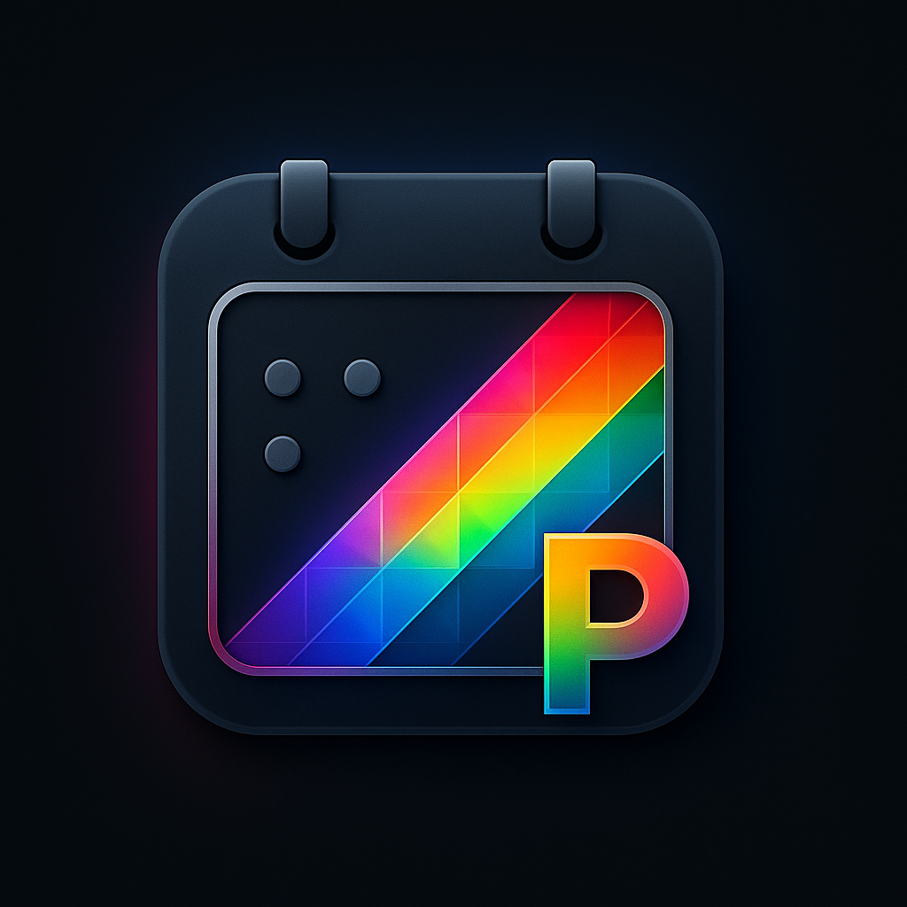

<div align="center">



# Prisma Calendar

**A feature-rich, fully configurable calendar plugin for Obsidian.**

</div>

Built for power users and newcomers alike, it gives you multiple isolated calendars, fine-grained filtering and color rules, fast folder-based indexing, and simple but powerful recurring events — all backed by plain Markdown notes.

What makes it different:

- Multiple calendars with their own folders, rules, and hotkeys
- Real notes as events (frontmatter-driven), not a proprietary database
- A simple recurring DSL and node-based recurrence that pre-generates future notes
- Virtual events for far-future instances to keep your vault light
- Reactive settings – changes are reflected instantly

[](https://www.youtube.com/watch?v=YOUR_VIDEO_ID)

**Repository**: [https://github.com/Real1tyy/Prisma-Calendar](https://github.com/Real1tyy/Prisma-Calendar)

> Goal: The most flexible, powerful calendar for Obsidian.

## Highlights

- Multiple isolated calendars (each with its own folder, filters, colors, hotkey)
- Folder-based event scanning (subfolders supported)
- Templater integration for creating event notes from your template
- Color rules with sensible default and rule-based overrides
- Event previews on hover; open on click
- Batch operations: delete, duplicate, move/clone to next week
- Recurring events DSL that generates real notes (node-based recurrence)
- Virtual events (read-only) beyond the generation horizon
- Reactive settings: changes reflect instantly

### What does an event look like?

Events are plain Markdown notes with frontmatter. You pick which frontmatter keys the calendar should read (e.g., `Start`, `End`, `AllDay`, `Title`).

```yaml
---
Title: Weekly Team Meeting
Start: 2025-01-15T09:00
End: 2025-01-15T10:30
AllDay: false
RRule: weekly
RRuleSpec: monday, wednesday, friday
Status: In Progress
Project: Q1 Planning
---

Agenda...
```

See Configuration for how to map these property names to your preferences and how to display extra properties inside event chips.
